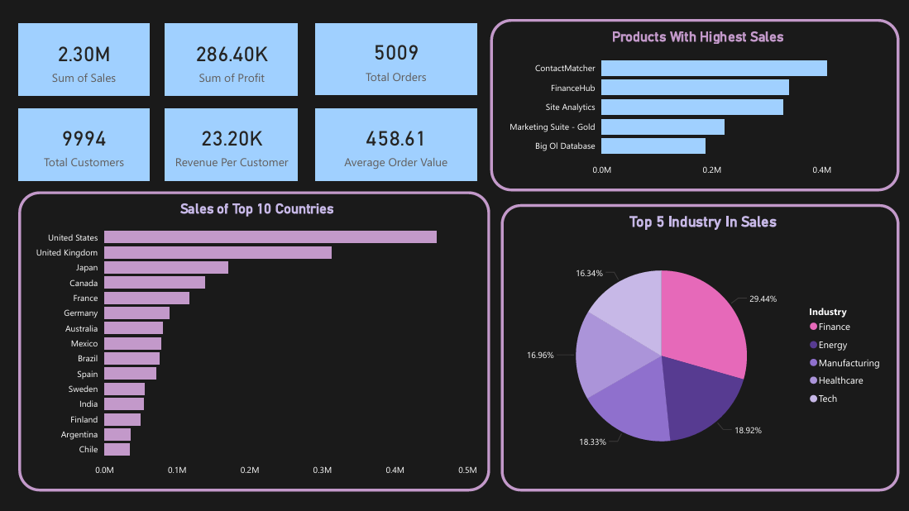
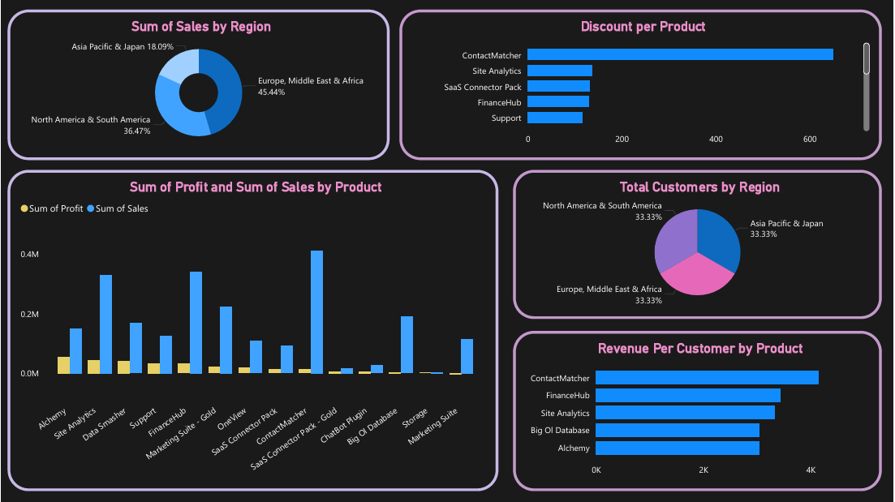

# Sales Analytics Dashboard (Power BI)

## Project Overview
The **Sales Analytics Dashboard** is an end-to-end **business intelligence solution** built using **Power BI** to analyze SaaS-style sales data. The project transforms raw transactional data into actionable insights across **revenue, profitability, customer behavior, product performance, and regional efficiency**.

The solution follows a **dual-dashboard architecture**:
- **Executive Dashboard** — answers *what is happening*
- **Analytics Dashboard** — explains *why it is happening*

This project demonstrates strong alignment between **business understanding, analytical reasoning, data modeling, and dashboard design**.

---

## Project Objectives
- Provide a high-level, executive-ready view of sales and profitability
- Enable deep analysis of performance drivers across products, regions, and customers
- Identify revenue concentration risks and margin inefficiencies
- Support data-driven decisions related to pricing, product strategy, and regional growth

---

## Intended Audience
This project is designed for:
- **Business Stakeholders** — monitoring performance and guiding strategy
- **Data Analysts / BI Developers** — reviewing modeling, metrics, and architecture
- **Product Managers** — deriving product and customer insights
- **Recruiters & Portfolio Reviewers** — evaluating analytical depth and documentation quality

---

## Dataset Overview

### Data Source
- **Platform:** Kaggle  
- **Domain:** SaaS Sales Analytics (AWS-style product portfolio)  
- **Data Type:** Historical transactional sales data  

### Data Scope
- **Total Orders:** 5,009  
- **Total Revenue:** $2.30M  
- **Total Profit:** $286.40K  
- **Total Customers:** 9,994  
- **Regions Covered:** Americas, EMEA(Europe & Middle East), APJ (Asia Pacific & Japan)  
- **Industries:** Finance, Energy, Manufacturing, Healthcare, Technology  

---

## Data Preparation & Modeling

### Data Quality & Cleaning
Initial data validation identified missing values, inconsistent naming conventions, formatting issues, and duplicate records. The following steps were applied:
- Null value handling through exclusion or logical imputation
- Standardization of region, country, product, and industry names
- Validation and formatting of numeric and currency fields
- Removal of duplicate or invalid transactions

### Calculated Fields
To enhance analytical depth and consistency:
- **Average Order Value (AOV)**
- **Revenue per Customer**
- **Profit Margin**

### Data Modeling Approach
A **dimensional (star schema)** design was implemented:
- **Fact Table:** Sales Transactions  
- **Dimension Tables:** Products, Customers, Regions, Industries  

This structure improves query performance, simplifies calculations, and supports flexible slicing across dashboards.

---

## Dashboard Architecture

### Executive Dashboard — *What Is Happening*
Designed for leadership and high-level reviews, this dashboard focuses on clarity, speed, and interpretability.

**Key Features**
- KPI cards for Total Sales, Profit, Orders, Customers, and AOV
- Sales contribution by region
- Top-performing countries, industries, and products

**Design Philosophy**
- Minimal interaction
- High clarity
- Low cognitive load

**Screenshot**

---

### Analytics Dashboard — *Why It Is Happening*
Built for analysts and product managers to investigate performance drivers and inefficiencies.

**Key Analyses**
- Sales vs Profit by Product
- Revenue per Customer by Product
- Regional efficiency comparison
- Discount impact analysis

**Design Philosophy**
- Comparative visuals
- Root-cause analysis
- Exploratory interaction using slicers and filters

**Screenshot**

---

## Key Metrics Overview
- **Total Sales:** Overall revenue scale
- **Total Profit:** Financial sustainability indicator
- **Total Orders:** Transaction volume
- **Total Customers:** Market reach
- **Average Order Value (AOV):** Deal size and pricing effectiveness
- **Revenue per Customer:** Customer value measurement
- **Profit Margin:** Pricing and cost efficiency

Metrics are consistently defined and reused across all visuals to maintain analytical accuracy.

---

## Business Insights

### Revenue Concentration Risk
A small subset of products drives a large share of revenue and profit, creating portfolio dependency risk.

### High Sales ≠ High Profit
Some products show strong revenue but weak profitability due to discounting or cost inefficiencies.

### Regional Revenue Imbalance
Despite similar customer counts, EMEA generates significantly higher revenue per customer than APJ.

### Discount Strategy Weakness
Inconsistent discounting does not always translate into higher profit and risks margin erosion.

### Industry Specialization Success
Finance industry dominance validates the effectiveness of vertical-specific product strategies.

---

## Strategic Recommendations
- Shift toward **profitability-first product evaluation**
- Implement structured **discount governance policies**
- Increase **revenue per customer in APJ** through upselling and premium offerings
- Replicate Finance-sector success across other industries
- Invest in customer success to improve retention and repeat purchasing

---

## Limitations
- Static historical dataset
- No real-time data refresh
- No role-based access control
- No predictive or forecasting analytics

---

## Future Enhancements
- Live data integration with automated refresh
- Revenue forecasting and churn prediction models
- Role-based dashboards for different stakeholders
- Automated KPI alerts
- Mobile-optimized dashboard experience

---

## Conclusion
This project represents a **production-style BI solution** that balances executive usability with analytical depth. Through clean data preparation, robust modeling, well-defined metrics, and insight-driven dashboards, the Sales Analytics Dashboard enables informed decision-making and serves as a strong portfolio artifact for data and business analytics roles.
